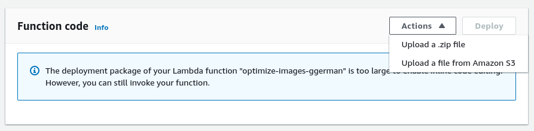
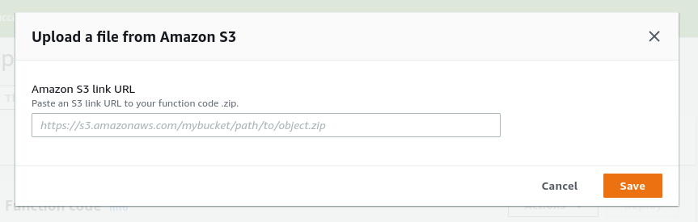
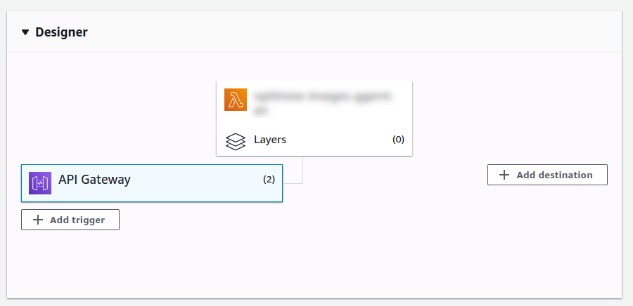
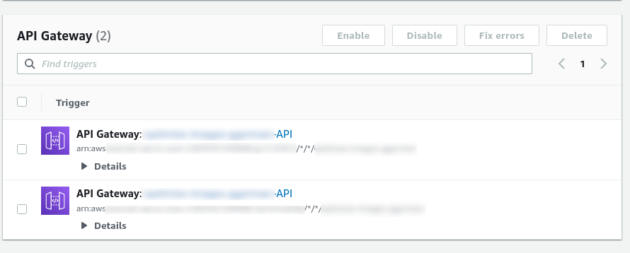
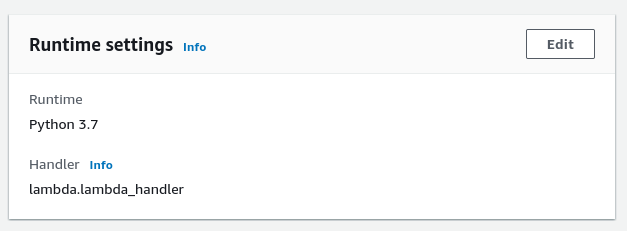
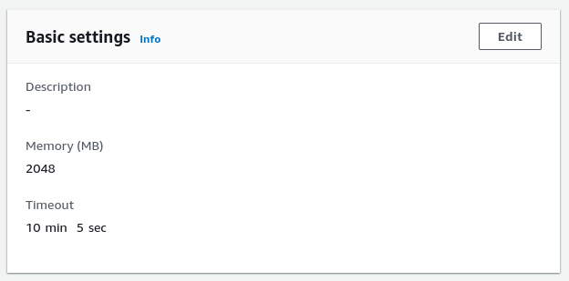

# AWS Lambda function upload images and save into different folders with differents sizes.

## Target:
Get image and save this inside "products/" (folder) and "product_id" (folder) in differents sizes.

### Instalation:

### Requriments: Python >= 3.7

### Install package:
```
pip install --target . json
pip install pip install --target . boto3
pip install pip install --target . requests
pip install pip install --target . PIL
pip install pip install --target . Pillow
```

#### Problem:
**_Error: cannot import name '_imaging' from 'PIL' Python 3.7 runtime_**

Pillow swouldswould ork but the solution is download the file and decompress inside in the same folder:

```
Pillow-7.1.2-cp37-cp37m-manylinux1_x86_64.whl
```
[Library](https://files.pythonhosted.org/packages/ab/f8/d3627cc230270a6a4eedee32974fbc8cb26c5fdb8710dd5ea70133640022/Pillow-7.1.2-cp37-cp37m-manylinux1_x86_64.whl#sha256=0e2a3bceb0fd4e0cb17192ae506d5f082b309ffe5fc370a5667959c9b2f85fa3)


### Compress the folder with the lambda function:
zip -x '.git' -x '.git/*' -x 'documentation' -x 'documentation/*' -r9 '../upload_images.zip' .

### Upload Code to AWS Bucket and upload to the lambda function:



### gateway
add Gateway for external connection.



### Runtime Settings:
Configure the python version and name of the lambda file and function:



### Basic Settings
Set time for wait the function run and set the memory quantity.




### Bash call the lambda function:
```
curl -X POST -k -H 'Content-Type: application/json' -i '<API endpoint>' --data  '[{"url": "<source_image_name>", "bucket_prefix":"<prefix>", "bucket_name": "<bucket_name>", "bucket_suffix": "<suffix>", "product_id": "<folder_name>", "name": "<destination_file_name>"}]' 
```

#### Complete Official Documentation:
[AWS Documentation](https://docs.aws.amazon.com/lambda/latest/dg/welcome.html)


